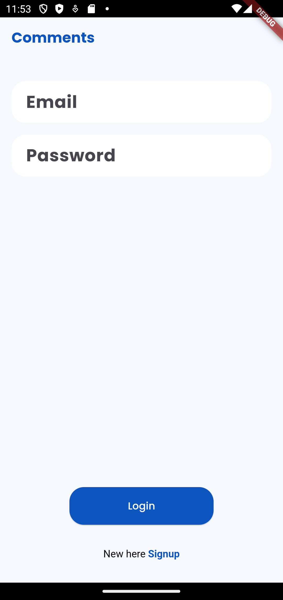
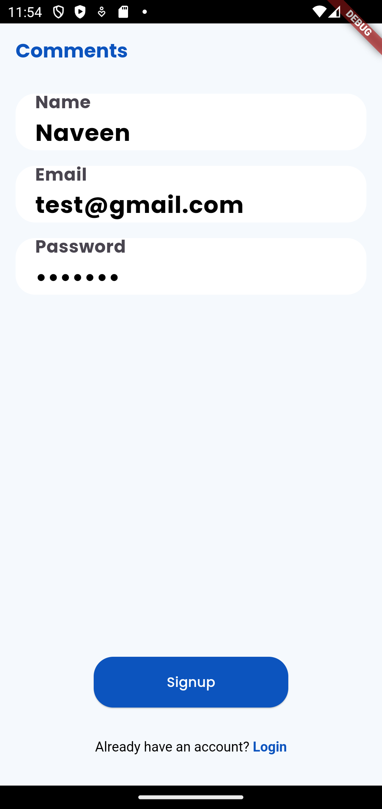
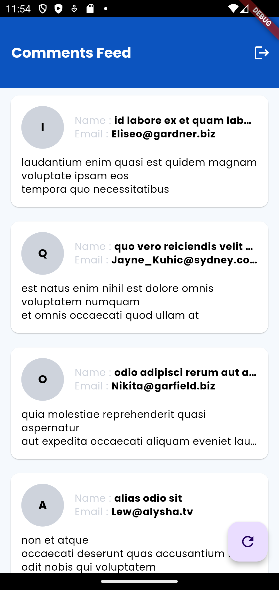
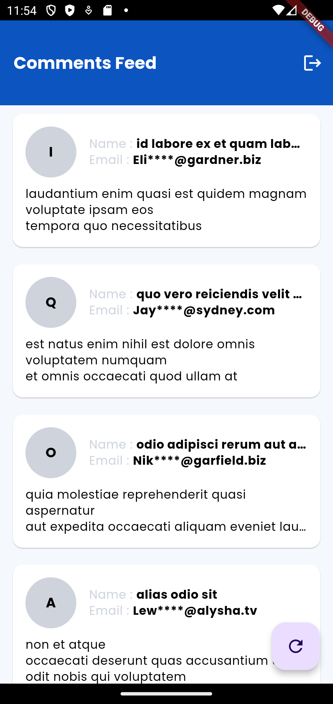

# Comments App

A simple Flutter application that fetches comments from an API, displaying them in a user-friendly way. The app integrates with Firebase Remote Config to manage feature flags, such as masking email addresses.

## Features

- **Firebase Remote Config Integration**: The app uses Firebase Remote Config to dynamically toggle the visibility of full email addresses in comments. The `mask_email` key controls whether email addresses are partially masked.
  
- **Masked Emails**: When the `mask_email` feature is enabled via Firebase Remote Config, users' email addresses are partially hidden, showing only the first three characters and the domain.

- **State Management**: The app uses `Provider` for state management, keeping the UI reactive and updating it when new data is fetched.

- **API Integration**: Comments are fetched from an external API using a custom `ApiService`, which returns a list of comments.

```
-- lib
   |-- models
   |-- services
   |-- screens
   |-- widgets
   |-- providers
   |-- main.dart

```

## Folder Explanation
- models: This folder contains data models that represent the structure of data used in the app. For example, the Comment model defines the structure of a comment, including fields such as name, email, and the comment text. These models act as blueprints for the data that flows through the app and make it easier to parse API responses.

- services: The services folder handles external API calls and data fetching logic. For instance, it could have services that fetch comments from a remote server. This is also where you manage interactions with external resources like APIs, databases, or Firebase. Keeping this separate ensures that the API logic is clean and easy to manage.

- screens: This folder contains the primary screens or pages that make up the UI of the app. For example, the comments screen displays a list of comments fetched from an API. Each screen represents a full page or section of the app and often interacts with widgets and providers to display data to the user.

- widgets: The widgets folder contains reusable UI components that can be used throughout different screens. For example, a comment card that displays individual comments will be placed here. This ensures that UI components can be easily reused and modified independently without affecting the main screens.

- providers: This folder manages state using Provider, a state management library in Flutter. The providers handle the business logic and manage the state of the app, ensuring that data flows between the UI and the underlying services efficiently. For example, a comment provider would manage the state of comments and notify the UI when new data is available.

- main.dart: The entry point of the Flutter app, where the app is initialized and the main widget tree is built. This file sets up the overall structure of the app, such as theming, navigation, and initial provider configurations.


## Snapshots




[click here for demo video](https://drive.google.com/file/d/1uf_8iVcLeH5rtF9MnGC3WbhLAYMpCNvR/view?usp=sharing)